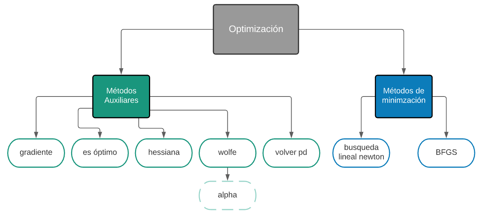

# Optimización
> Este documento es una clase en Python que contiene varios métodos para minimizar una función.
## Índice
* [Supuestos](#supuestos)
* [Parámetros](#parámetros)
* [Diagrama general](#diagrama-general)
* [gradiente](#technologies)
* [hessiana](#hessiana)
* [es optimo](#setup)
* [wolfe](#features)
* [aplha](#status)
* [volver_pd](#volver_pd)
* [busqueda_lineal_newton](#busqueda_lineal_newton)
* [BFGS](#BFGS)
* [comparación](#comparación)
* [Ejemplos](#ejemplos)
## Supuestos
* La función es continua.
* La función es dos veces diferenciable en los reales.
* Buscamos el mínimo (local) de la función.
## Parámetros
* function: es la función a optimizar. Puede ser una función def de Python o una "lambda x"; hay ejemplos más adelante.
* max_iters: iteraciones máximas que se van a realizar si no se cumple la tolerancia, si no se indica se utilizarán 300. Generalmente, arriba de 200 iteraciones la precisión no mejora significativamente.
* tol: Es la precisión que se pide a los algortimos para decidir si se llegó a un mínimo.
## Diagrama general

## gradiente
Calcula el vector de derivadas parciales de la función f en un punto x en específico.
## hessiana
Calcula la matriz de segundas derivadas parciales de f en un punto x en específico.
## es_optimo
Regresa verdadero si se cumple la tolerancia para un punto x, y falso en caso contrario.
## wolfe
Dada una $alpha$, verifica si se cumplen las condiciones de Wolfe para un punto x.
## alpha
Dada una x, calcula iterativamente $alpha$ hasta que cumpla las condiciones de Wolfe
## volver_pd
Dada una **matriz** x, verifica si es positiva definida, si lo es regresa x, si no la convierte en positiva definida y regresa la matriz modificada
